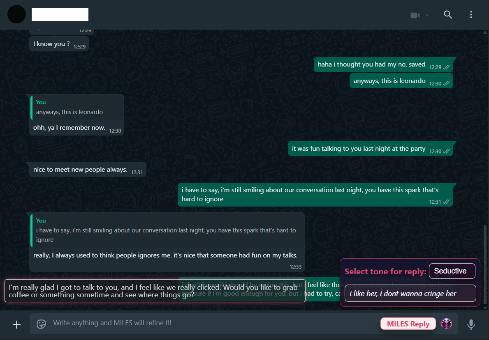
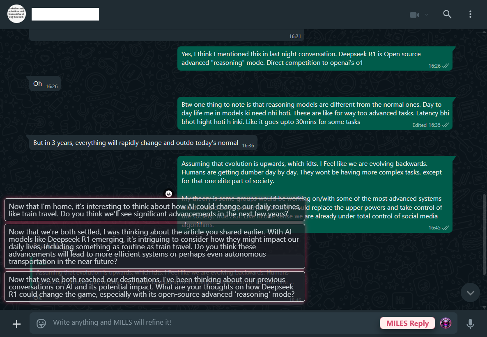
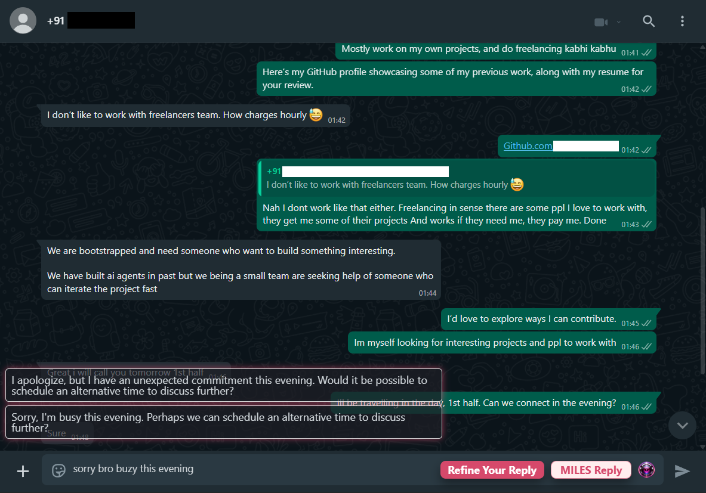
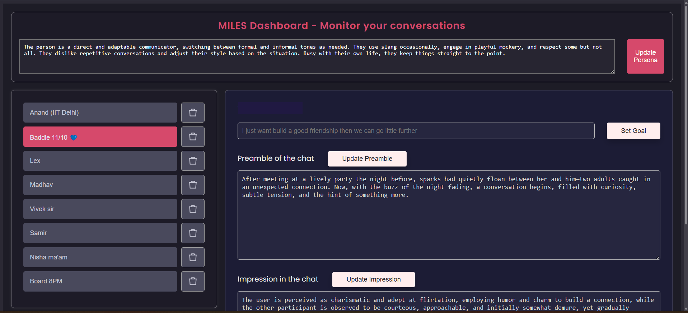
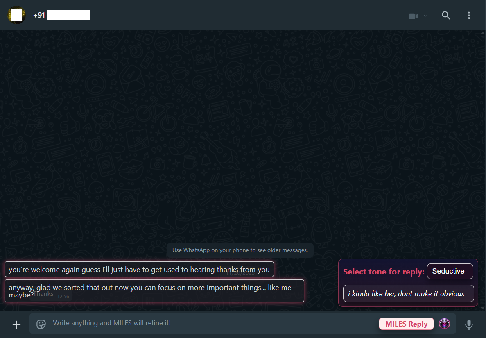

<h1 align="center">MILES AI | Smart Reply Assistant | Your Ultimate Reply Wingman</h1>

    

## Overview

Miles is a handy Chrome extension powered by advanced AI technology to enhance your WhatsApp chatting experience. It
generates personalized replies that mimic your tone and language, making your conversations smoother and more engaging
in a single click.

<!-- 

    Demo Video here

 -->

- Struggling to reply to your crush without sounding weird?
- Need to sound confident with your boss without overthinking every word?
- Got a hot conversation going but don’t know how to keep the spark alive—or cover up a slip?
- MILES has your back.

## 📍 Real Moments. Real Panic. Real Replies.

- "Hey, I saw you staring at me during class. You're kinda cute." 
    - Dang. She noticed.  
        - *Now what? Deny it? Own it? Make her smile?*  
            - You're one message away from winning her over—or ruining the vibe.

- "Hey, what’s the status on the milestone? We need your input before we proceed."  
    - Project? Milestone? You haven’t even opened the doc.  
        - *You’ve got 2 minutes to sound composed, confident, and not get exposed.*  
            - Time to fake it like a pro (without sounding fake).

- "Soo... you like me or what? 👀"  
    - Oh. My. God. She dropped the bomb.  
        - Now the whole tone of the convo hangs on your next line.  
            - Be funny? Be flirty? Be smooth?  
                - *Say the wrong thing—game over. Say the right thing—hello late-night calls.*

    

## Get Started

(chrome extension link)[]

## What you get?

❤️ Crush mode ON – Know exactly what to say and how to say it, every time
💬 Context-aware suggestions so you never send a dry or awkward text again
💼 Nail formal replies – Be smooth, smart, and respectful with clients, managers, or investors
🧠 Smart memory – Remembers your style, preferences, and inside jokes
💼 Perfect for professionals, founders, creators, and high-volume texters
🔥 Save time, sound better – No more rewrites, no more overthinking

### Generating Replies

You're all set! To generate replies while chatting on WhatsApp:

-   Reload Whatsapp Web.
-   Click 'miles reply' for generating a reply. Click the generated reply that you want and done.

    

-   If you want to refine or re-phrase your raw reply according to a certain 'Tone' (say formal, or romantic, or casual, or something), just type your reply and click 'refine your reply' button, and select your 'Tone'.

    

-   Configure MILES using the dashboard.

    

Miles will provide AI-driven responses that match your style and tone.

    

## 🔑 Features

-   Generate personalized replies with one click
-   Mimics your unique tone and language
-   Multiple tones: casual, formal, romantic, and more
-   Dashboard for customizing behavior
-   Works seamlessly with WhatsApp Web
-   Use keywords for crafting better and more focused replies

## ✨ Every situation is make-or-break. MILES helps you break through, not break down.
Whether you’re building relationships or sealing the deal—romantic or professional—MILES makes every word work harder.
