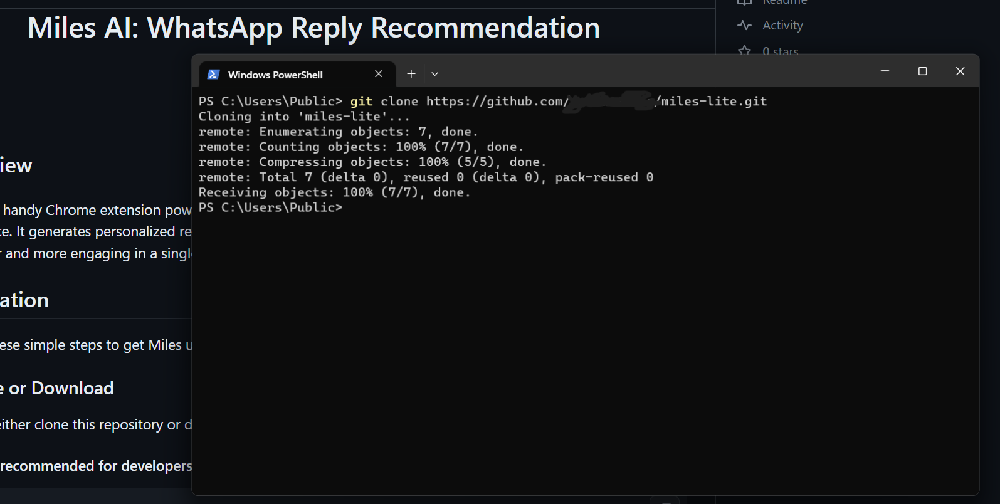
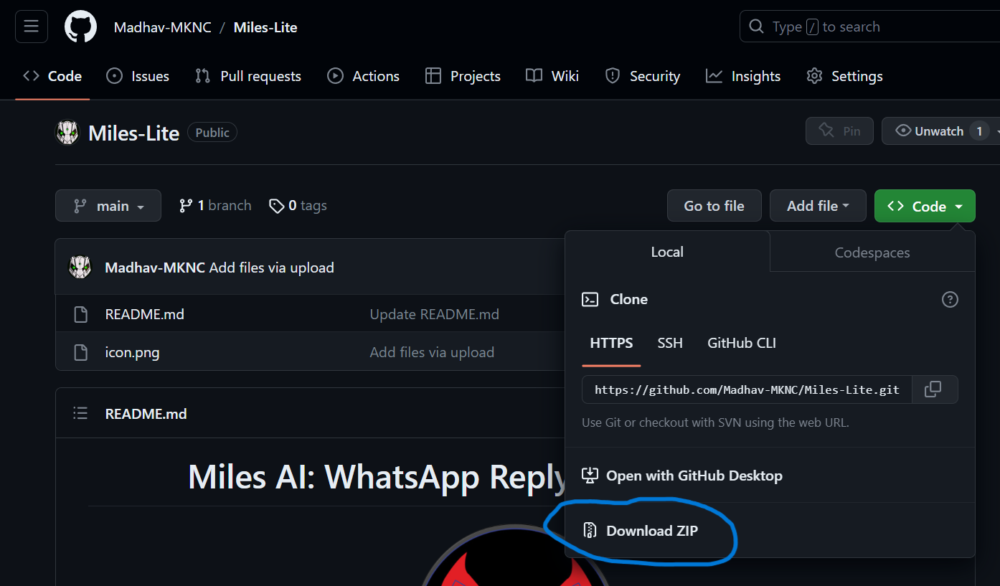
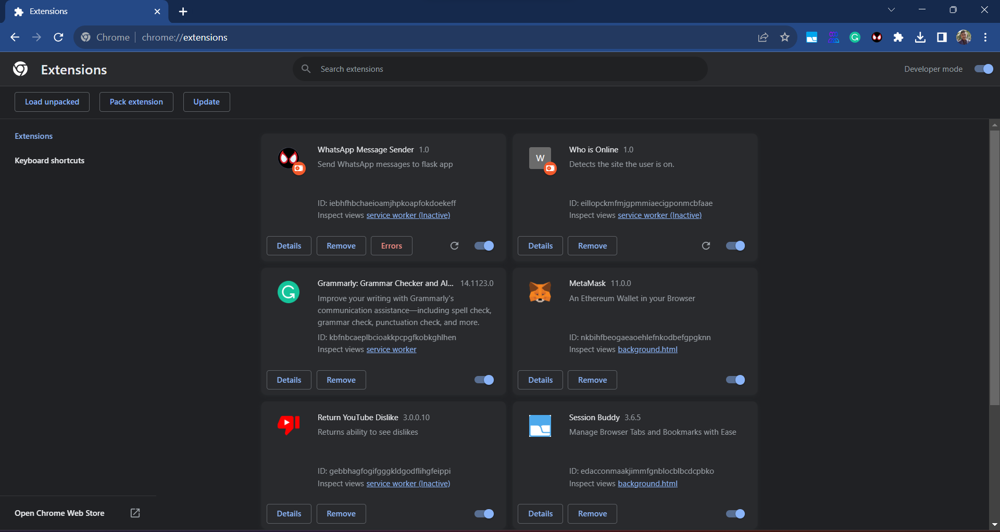
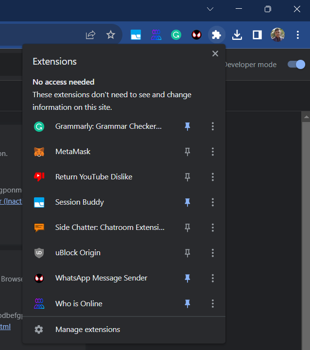
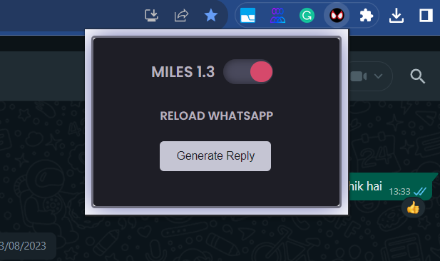
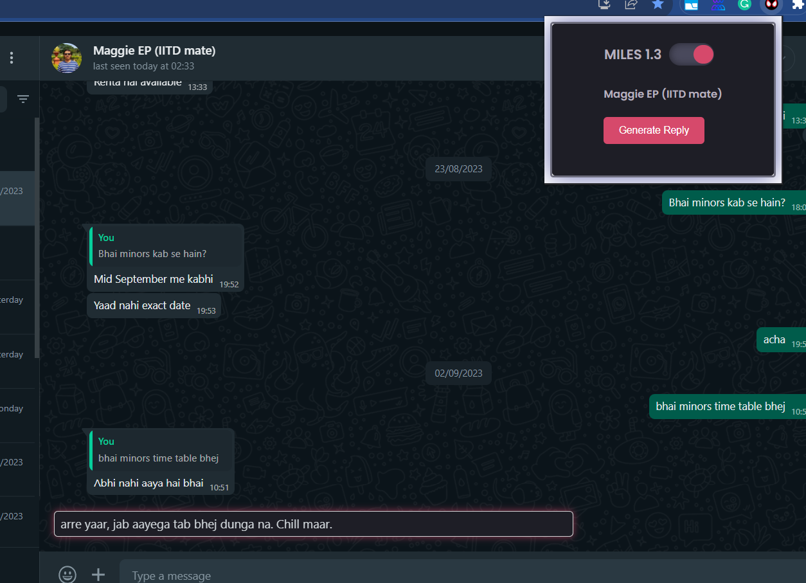

<h1 align="center">Miles AI: WhatsApp Reply Enhancement</h1>

<p align="center">
    
</p>

<h4 align='center'>(version 1.3)</h4>

## Overview

Miles is a handy Chrome extension powered by advanced AI technology to enhance your WhatsApp chatting experience. It
generates personalized replies that mimic your tone and language, making your conversations smoother and more engaging
in a single click.

## Installation

Follow these simple steps to get Miles up and running:

### 1. Clone or Download

You can either clone this repository or download it as a ZIP file. If you're new to GitHub, here's how:

#### Cloning (recommended for developers):

```
git clone https://github.com/aaron-davis-43/miles-lite.git
```

<p align="center">
    
</p>

#### Downloading (recommended for non-developers):

- Click the green "Code" button at the top of this page, then select "Download ZIP."

<p align="center">
    
</p>

### 2. Enable Developer Mode in Chrome

Miles is a Chrome extension, and you'll need to enable Developer Mode to use it:

- Open Google Chrome.
- In the URL bar, type `chrome://extensions` and press Enter.
- In the top-right corner, toggle on "Developer mode."

<p align="center">
    
</p>

### 3. Load the Extension

Now, let's load Miles into Chrome:

- Click on the "Load unpacked" button.
- Navigate to the directory where you cloned or extracted the Miles project files.
- Select the folder containing the `manifest.json` file and click "Select Folder."

<p align="center">
    
</p>

### 4. Pin the Extension

To easily access Miles, you can pin it to your Chrome toolbar:

- Find the Miles extension icon (usually located to the right of the URL bar).
- Right-click on the Miles icon.
- Select "Pin."

<p align="center">
    
</p>

### 5. Generating Replies

You're all set! To generate replies while chatting on WhatsApp:

- Open a WhatsApp chat.
- Click on the Miles extension icon in your toolbar.
- Click the "Generate" button.
- A text will be generated, just click on the text it will copy it to the clipboard.
- Paste the reply (CTRL + V)

<p>Miles will provide AI-driven responses that match your style and tone.</p>

<p align="center">
    
</p>

Get multiple replies generated on multiple clicks and click the one you like.

<p align="center">
    
</p>

<h3 align="center">Happy chatting with Miles!</h3>

<p align="center">Developed by Aaron Davis💟</p>

<p align="center">
    
</p>
